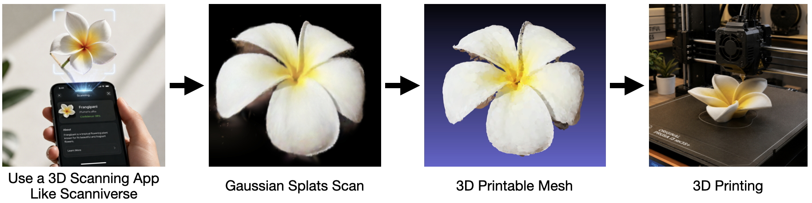

# Splatmesher



Splatmesher is a conversion tool that takes in a Gaussian Splatting file and creates a mesh out of it. The idea is that you can take something that you scanned with a Gaussian Splatting application and convert it to a proper mesh that you can print out on your 3D printer.

You can use, e.g. [Scanniverse](https://www.nianticspatial.com/products/capture) to scan the object and then transform it with Splatmesher.

## Usage

Create and activate the Python environment once per terminal session:

```bash
python3 -m venv .venv
source .venv/bin/activate
pip install -r requirements.txt
```

On Windows (PowerShell):

```powershell
python -m venv .venv
.venv\Scripts\Activate.ps1
pip install -r requirements.txt
```

Then convert a Gaussian Splatting scan to a mesh:

```bash
python splatmesher.py myscan.ply output.obj
```

Example with one of the included scans:

```bash
python splatmesher.py Examples/FrangipaniCropped.ply output.obj
```

To leave the environment when you are done:

```bash
deactivate
```

## How it is done
The general idea is that each Gaussian is approximated by an ellipsoid. Then it constructs a mesh from merging these ellipsoids.

### Detailed Algorithm

The core idea is to never try to "stitch" ellipsoids together explicitly (which is fragile
and rarely watertight). Instead we treat the cloud of Gaussians as a single continuous
**density field** and extract its iso-surface. Overlapping Gaussians then merge naturally,
and the result is a closed, printable mesh.

1. **Parse the splat.** Read the standard 3DGS PLY format. Per Gaussian we have:
   - `x, y, z` → mean position `μ` (the `nx, ny, nz` normals are ignored).
   - `scale_0..2` → axis lengths `s = exp(scale)` (stored as log-scale).
   - `rot_0..3` → rotation quaternion `q` (normalize, then convert to rotation matrix `R`).
   - `opacity` → `o = sigmoid(opacity)`.
   - `f_dc_0..2` → base color `RGB = 0.5 + C0 * f_dc` with `C0 = 0.2820947918`
     (DC term of the spherical harmonics; the `f_rest_*` view-dependent terms are dropped
     since a printed mesh has a single fixed color per point).

2. **Build per-Gaussian covariance.** `Σ = R · diag(s²) · Rᵀ`. This is the ellipsoid
   approximation: a level set of a single Gaussian is an ellipsoid with axes `s` oriented
   by `R`. Precompute `Σ⁻¹` for fast density evaluation.

3. **Clean up the cloud.** Gaussian splats contain noise, floaters and near-transparent
   blobs that hurt a watertight mesh:
   - drop Gaussians with opacity below a threshold,
   - drop degenerate / extremely thin or huge Gaussians,
   - remove statistical outliers / floaters (e.g. KD-tree nearest-neighbour distance test).

4. **Define the density field.** For a point `x` in space:
   `f(x) = Σ_i o_i · exp(-0.5 · (x - μ_i)ᵀ Σ_i⁻¹ (x - μ_i))`.
   The surface of the object is the level set `f(x) = τ` for a chosen iso-value `τ`.

5. **Sample the field on a voxel grid.** Compute the bounding box of the (filtered) means
   (with a small padding), pick a voxel resolution, and evaluate `f` at every voxel.
   This is the expensive step, so it must be accelerated: each Gaussian only meaningfully
   contributes within ~`k·σ` (e.g. `k = 3`) of its mean, so we only splat each Gaussian
   into its local block of voxels instead of evaluating every Gaussian at every voxel.

6. **Extract the iso-surface.** Run Marching Cubes on the voxel grid at iso-level `τ` to
   produce a triangle mesh. Overlapping Gaussians are now a single connected surface.

7. **Post-process the mesh** to make it clean and printable:
   - keep the largest connected component(s), discard small islands,
   - smooth (Taubin/Laplacian) to remove the blobby voxel staircase artefacts,
   - decimate to a reasonable triangle count,
   - ensure it is manifold / watertight and has consistent outward normals.

8. **Transfer color.** For each output vertex, find the nearest / density-weighted
   Gaussians (KD-tree) and assign the blended `RGB`. Export as per-vertex color or a
   texture/material so the color survives in the OBJ.

9. **Export** the mesh to OBJ (plus an MTL/vertex colors).

#### Key parameters to tune
- **voxel resolution** – mesh detail vs. memory/time,
- **iso-value `τ`** – how "thick" the surface sits relative to the Gaussian density,
- **`k·σ` cutoff** – speed vs. accuracy of the field,
- **opacity / outlier thresholds** – how aggressively floaters are removed,
- **smoothing & decimation strength** – surface quality vs. fidelity.

These are exactly the knobs the optimization loop below will search over.

### Implementation

Language: **Python 3** (matching the `python splatmesher.py ...` usage), built around
NumPy for the heavy numeric work.

**Dependencies** (to go in `requirements.txt`):
- `numpy` – arrays and vectorized math.
- `plyfile` – read the binary 3DGS PLY.
- `scipy` – `cKDTree` for neighbour queries (outlier removal, color transfer).
- `scikit-image` – `measure.marching_cubes` for iso-surface extraction.
- `trimesh` – mesh post-processing (components, smoothing, decimation, repair) and OBJ export.
- `pyrender` (or `open3d`) – offscreen rendering for the evaluation step.

**Module layout:**
- `splatmesher.py` – CLI entry point (argparse): input `.ply`, output `.obj`, and the
  tunable parameters above; orchestrates the pipeline.
- `io_ply.py` – parse the PLY into a `Gaussians` structure
  (means, scales, quats, opacity, color).
- `gaussian.py` – quaternion→`R`, build `Σ` and `Σ⁻¹`, sigmoid/exp/SH-DC conversions,
  cloud filtering (opacity, degenerate, outliers).
- `field.py` – voxel grid construction and the accelerated "splat each Gaussian into its
  local voxel block" density accumulation.
- `surface.py` – Marching Cubes wrapper producing vertices/faces.
- `postprocess.py` – connected components, smoothing, decimation, watertight repair.
- `color.py` – KD-tree color transfer to mesh vertices.
- `export.py` – write OBJ (+ MTL / vertex colors).

**Evaluation & optimization harness** (drives the section below):
- `evaluate.py` – load a mesh, render it from the 5 fixed viewpoints
  (top, left, right, front, back), and compute the mean L1 pixel-color difference against
  the reference renders of the Examples meshes.
- An optimization driver that sweeps the key parameters, runs `evaluate.py`, and keeps the
  configuration that lowers the L1 error (committing improvements to git, as described
  below).

**Suggested build order (incremental TODOs):**
1. PLY parsing + `Gaussians` struct, verified on `Examples/Pear.ply` and
   `Examples/FrangipaniCropped.ply`.
2. Covariance + density field on a coarse grid (correctness first, speed later).
3. Marching Cubes → raw OBJ; visually sanity-check the shape.
4. Spatial acceleration for the field (KD-tree / local splatting).
5. Mesh post-processing (clean + watertight).
6. Color transfer + OBJ/MTL export.
7. Evaluation harness (5-view L1).
8. Parameter optimization loop.

### Evaluation
For evaluation of the algorithm, there are some example meshes in the Examples folder which can be rendered from 5 fixed viewpoints (top, left, right, front, back) and then compared to rendering the mesh from the same view. The average pixel color difference (L1 difference) is the error to be minimized.

### Method for Optimizing the Algorithm
To get the best algorithm, it can be optimized using the Evaluation: try out an idea for improvement, evaluate it and compare it to the current baseline. If it is better, commit it to git. You have to think a bit out of the box and try many different ideas.
